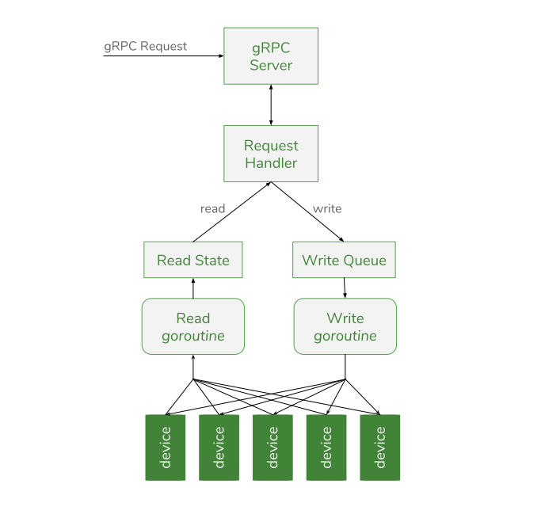

Synse Plugin SDK
================

The Synse Plugin SDK is the official SDK used to write plugins for
`Synse Server <https://github.com/vapor-ware/synse-server>`_ in order to provide
support for additional devices. Synse Server provides an HTTP API for monitoring
and controlling physical and virtual devices, but it is the backing plugins that
provide the support (telemetry and control) for all of the devices that Synse Server
exposes.

The SDK handles most of the common functionality needed for plugins, such as configuration
parsing, background read/write, transaction generation and tracking, meta-info caching, and more.
This means the plugin author should only need to worry about the plugin-specific device support.

User Guide
----------
The official guide for using the Synse Plugin SDK. This section goes over some of the
SDK basics and provides a verbose tutorial on how to build a simple plugin. With this
information, along with the `GoDoc <https://godoc.org/github.com/vapor-ware/synse-sdk/sdk>`_,
you should be able to make the most out of the Plugin SDK.

.. toctree::
   :maxdepth: 2

   user/basics
   user/advanced
   user/configuration
   user/tutorial

Community Guide
---------------
Learn about the Synse Plugin SDK ecosystem and community. This section outlines the
community guidelines, provides license info, and gives details on how to contribute
to the Plugin SDK.

.. toctree::
   :maxdepth: 2

   community/plugins
   community/license
   community/contributing
   community/release_process

Development
-----------
Learn about the development processes for the Synse Plugin SDK. If you want to contribute
to, play around with, or fork the Plugin SDK, this section will familiarize you with the
development workflow, testing practices, etc.

.. toctree::
   :maxdepth: 2

   dev/setup
   dev/testing
