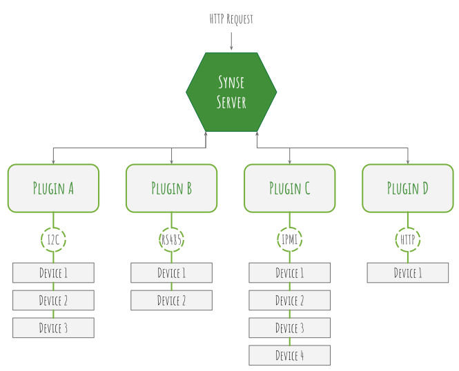

.. _basics:

The Basics
==========
This page describes some of the basic concepts and features of the SDK for
plugin development that most, if not all plugins, will use. See the
:ref:`advancedUsage` page for an overview of some of the more advanced features
of the plugin SDK.

Architecture Overview
---------------------
Before describing the various pieces of the SDK, it makes sense to talk about
the architecture of a plugin at a higher level. This will help to provide some
greater context around some of the components described here and in other parts
of the documentation.

For this overview, there are two levels of architecture we will look at:

Plugin Integration with Synse Server
~~~~~~~~~~~~~~~~~~~~~~~~~~~~~~~~~~~~

The diagram above provides a high level depiction of how plugins are used
by Synse Server. In short, when an HTTP API request comes into Synse Server, e.g.
a read request, that request will come with routing information for the device
it wants to read from, ``<rack id>/<board id>/<device id>``.

This routing information is used by Synse Server to lookup the device and figure
out which plugin owns that device and is responsible for its reads/writes. The
lookup is done using a meta-info cache that is built by Synse Server on startup
when it registers configured plugins and requests meta-info for the devices they
manage.

Once Synse Server knows where the request is going, it sends over all relevent
information to that plugin via the `internal gRPC API <https://github.com/vapor-ware/synse-server-grpc>`_.
Then, it is up to the plugin to fulfil the request using whatever protocol it
implements and return the appropriate response back to Synse Server.

Plugin Data Flow
~~~~~~~~~~~~~~~~

.. image:: ../_static/plugin-arch.svg

The diagram above provides a high level depiction of some of the data flows
in a plugin, namely for ``reads`` and ``writes``. ``metainfo`` and ``transaction``
requests are less interesting to the reader since they are handled by the SDK.

When a gRPC *read* request comes in, the plugin's gRPC read handler will look up
that device in a readings cache. If the device does not exist, no reading is
returned. If it does exist, that reading is returned.

The reading cache itself is updated on an interval (as set via the plugin
configuration) by a "reader" goroutine. This goroutine iterates through all of
the configured Devices and, if they are readable, executes the read handler
for that device. The reading cache is updated with the reading returned from
that handler.

When a gRPC *write* request comes in, the process flow is a little different.
The gRPC server's write handler will first create a transaction for the write
and then put the write transaction onto a write queue. The transaction is
returned to Synse Server -- writes are asynchronous and the status of the
write should be checked via the returned transaction.

Once a write transaction is on the queue, it will wait for the write goroutine
to take it off the queue and fulfil the transaction's write request. This is
also done on an interval (set via the plugin configuration).

The Data Manager
----------------
The Data Manager is a core component of a plugin. While the user should never
have to directly interact with the Data Manager, it is still good to know about.

The data manager is in charge of the read goroutine, the write goroutine, and
the data that gets passed to and from them. It holds the "read cache" and the
"write queue" and manages locking around data access, when necessary.

The Read and Write Loops
------------------------
Reading and writing happens in separate loops. More specifically, reading and
writing happens in different goroutines altogether. This is done to allow different
intervals around reading and writing (e.g. you may want your plugin to update
quickly -- write every 1s, but you may not need to update readings as quickly --
read every 30s).

A plugin can run in one of two modes: ``serial`` or ``parallel``. These mode
settings directly effect the behavior of the read/write goroutines. In serial
mode, device access will be locked -- reading and writing cannot happen
simultaneously. In parallel mode, there is no locking -- reads and writes
can happen simultaneously.

Devices
-------
Within the SDK, a `Device <https://godoc.org/github.com/vapor-ware/synse-sdk/sdk#Device>`_
is really just a model that holds the configuration information joined from
a prototype config and a device instance config.

The Devices hold all of the meta-information for a device as well as references
to their read and write handlers and identifier handler.

Readings
--------
A `Reading <https://godoc.org/github.com/vapor-ware/synse-sdk/sdk#Reading>`_
describes a single data point read from a device. It consists of the
reading type, the reading value, and the time at which the reading was
taken.

When generating new readings within a Device's read handler, it is important
to not initialize a ``Read`` struct directly, but instead to use the SDK's
``NewReading`` function. This function will auto-populate the timestamp field
with a timestamp in the RFC3339Nano format, which is the standard time format
for plugins and Synse Server.
